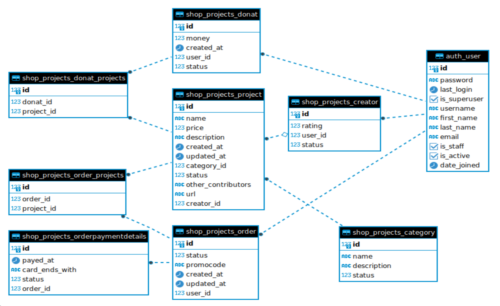

# Django project name: `Professional platform`

## App #1: `shop projects`
## Models:
- Creator
- Category
- Project
- Order
- OrderPaymentDetails
- Donat

## Signals:
- `post_save` signal for `OrderPaymentDetails` instance creating,
when Order is updated/created (save action)

## SharedTasks:
- send mail, when signal `post_save` from Order received 

## Project start commands
Root level:
- `docker compose up -d`
- `docker compose -f docker-compose_rabbit.yml up -d`

Project level:
- `python manage.py migrate`
- `python manage.py runserver`
- `celery -A pro_platform worker -l INFO`

Alternative start:
- bash start_project.sh
- bash start_celery.sh
