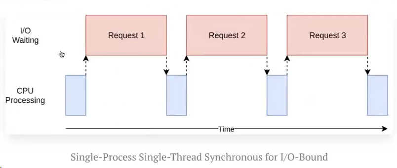
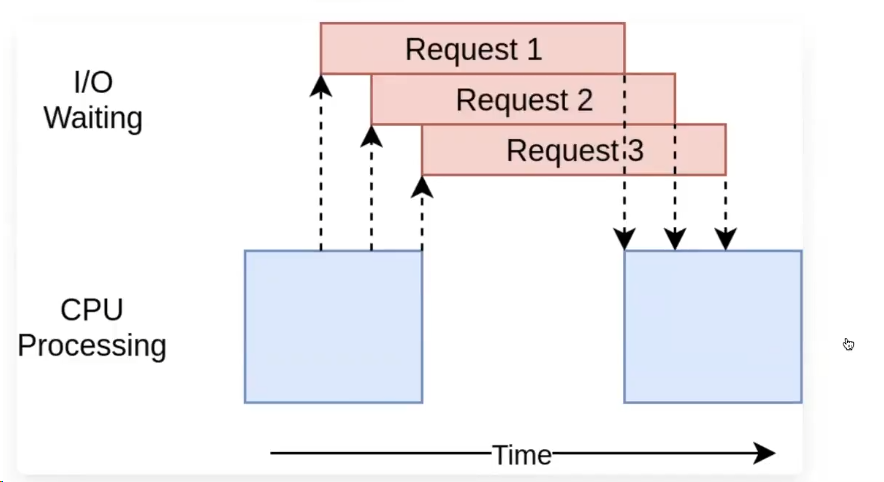

## Асинхронное программирование в Python

> Нужно для асинхронного взаимодействия с сетью

`Async I/O` (asyncio)

Notes:
- Асинхронное программирование НЕ будет быстрее синхронного, если не учитывать
особенности асинхронного подхода

asyncio is used as a foundation for multiple Python asynchronous frameworks 
that provide: 
- high-performance network 
- web-servers
- database connection libraries
- distributed task queues and etc.

asyncio provides a set of high-level APIs to:
- run Python coroutines concurrently and have full control over their execution;
- perform network IO and IPC;
- control subprocesses;
- distribute tasks via queues;
- synchronize concurrent code;

Types of tasks:
- CPU Bound means the rate at which process progresses is limited by the speed of the CPU. 
A task that performs calculations on a small set of numbers, 
for example multiplying small matrices, is likely to be CPU bound.
- I/O Bound means the rate at which a process progresses is limited by the speed of the I/O subsystem. 
A task that processes data from disk, for example, 
counting the number of lines in a file is likely to be I/O bound.
- Memory bound means the rate at which a process progresses is limited by the amount memory available and the speed of that memory access. 
A task that processes large amounts of in memory data, 
for example multiplying large matrices, is likely to be Memory Bound.
- Cache bound means the rate at which a process progress is limited by the amount and speed of the cache available. 
A task that simply processes more data than fits in the cache will be cache bound.

### Without async:

### With async:

