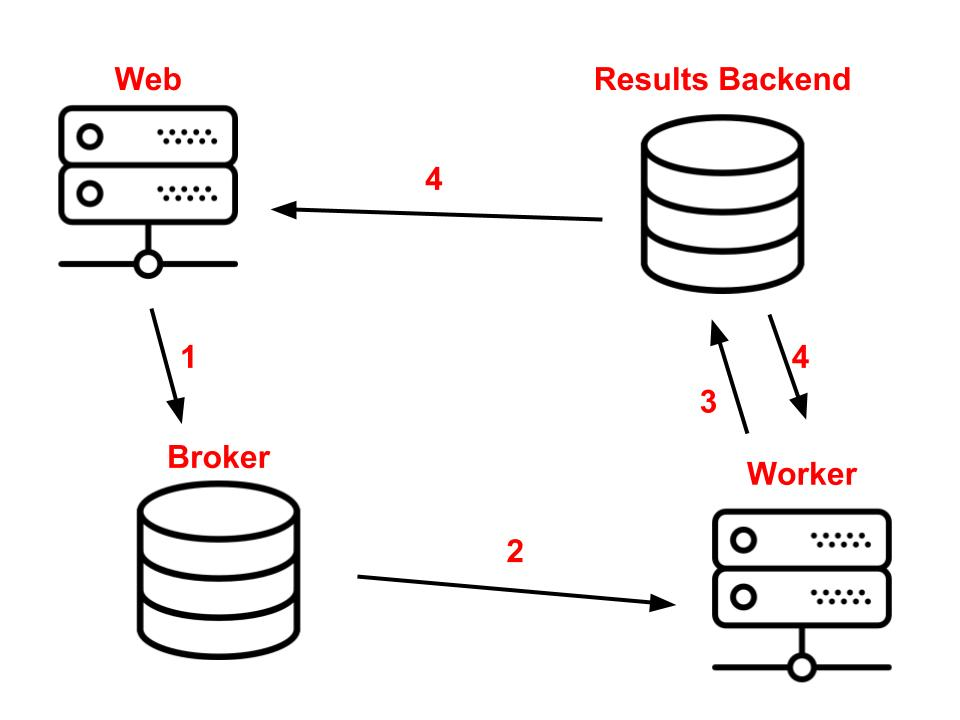

## Signals
Сигналы отправляются для любых изменений (в том числе моделей)

Например, задача:
`При создании заказа нам нужно автоматически создавать детали`. 
Данное связанное действия можно реализовать через сигнал
Алгоритм:
- Используем сигнал `post_save` (нужно учитывать: после сохранения изм-ий или создания)
- Создаём функцию под декоратором `receiver`, отправителем ставим `Order`
- Функция принимает параметры:
    - instance: Order (экземпляр класса, который будет сохранён)
    - created: bool (если True, то только при создании новой записи)
- `if created: OrderPaymentDetails.objects.get_or_create(order=instance)`

Сигналы удобно создавать для цепочки связанных действий, например:
- При создании заказа создаются детали онём
- При создании юзера создаются доп профили, счета и т.п.
*** Так же сигналы есть разных видов, т.е. НЕ только на создание (Signals в Toolbar)

## Delay (shared) task
Действие, которое выполняется через какое-то время (НЕ сразу)

`Celery` - Distributed Task Queue
Использует различные бэкенды:
- RabbitMQ (позволяет хранить и доставлять сообщения)
- Redis
- Amazon SQS
- Zookeeper

Алгоритм работы Celery:
https://www.vinta.com.br/blog/2017/celery-overview-archtecture-and-how-it-works/



Для конфигурации параметров по умолчанию используется: `CELERY_` prefix

Алгоритм запуска: 
https://docs.celeryq.dev/en/stable/django/first-steps-with-django.html


Notes:
- AMQP (Advanced Message Queuing Protocol) — открытый протокол прикладного уровня 
для передачи сообщений между компонентами системы.
- Нужно отдельно обновить `celery -A pro_platform  worker -l INFO`, чтобы
применились изменения!!!!!!! в коде для брокера

Для запуска проекта:
- `docker compose up -d`
- `docker compose -f docker-compose_rabbit.yml up -d rabbitmq`
- `python manage.py migrate`
- `python manage.py runserver`
- `celery -A pro_platform worker -l INFO`

*** Отложенные задачи сохраняются в rabbit и от туда берутся и 
выполняются воркером. При этом пользователь НЕ блокируется!***

Commands:

Install main dependencies and delete others
```shell
poetry install --only-main --sync
```

Create auto empty migration
```shell
python manage.py makemigrations shop_projects --empty
```

```