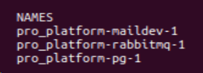

Для запуска проекта:
- `docker compose up -d`
- `docker compose -f docker-compose_rabbit.yml up -d rabbitmq`
- `docker compose -f docker-compose_rabbit.yml up -d maildev`
- `python manage.py migrate`
- `python manage.py runserver`
- `celery -A pro_platform worker -l INFO`

