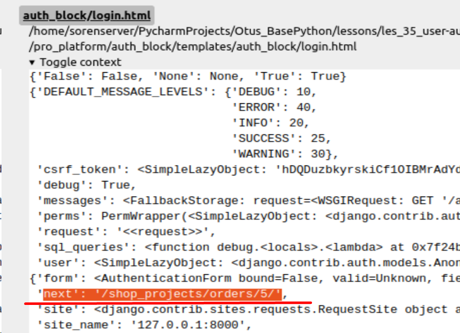

Algorithm updating user password from debug shell:
1. from django.contrib.auth.models import User
2. sam = User.objects.filter(username="sam").get()
3. sam.set_password("123")
4. sam.save()

Adding new app:
1. Creating (`python manage.py startapp auth`)
2. adding `auth.apps.AuthConfig` to settings.py of project 
3. create urls.py
4. add url of app in main urls.py of project 

Adding restriction:
1. `@login_required` for function based views
    `LoginRequiredMixin` as first arg for class based views
2. In settings add `LOGIN_URL = reverse_lazy('auth_block:login')`
3. Forward `next` to form (login.html)

`<input type="hidden" name="next" value="{{ next }}">`
4. 

Adding permission:
first way
1. `PermissionRequiredMixin` as first arg for class
2. permission_required = "shop_projects.delete_donat"
   * permission get from `auth_permission` table
3. In `donat_details` template: add `if perm.shop_projects.delete_donat`

second way
1. UserPassesTestMixin in DonatDetailView
2. create `test_func`


Commands:
Enter in debug shell
```shell
python manage.py debugsqlshell
```
creating new app
```shell
python manage.py startapp auth
```

Notes:
- through debugsqlshell we can to display mro (Method Resolution Order)
of the Class

ToDoList:
- Creating OrderPaymentDetails when it fill
togather with Order (adminka)


